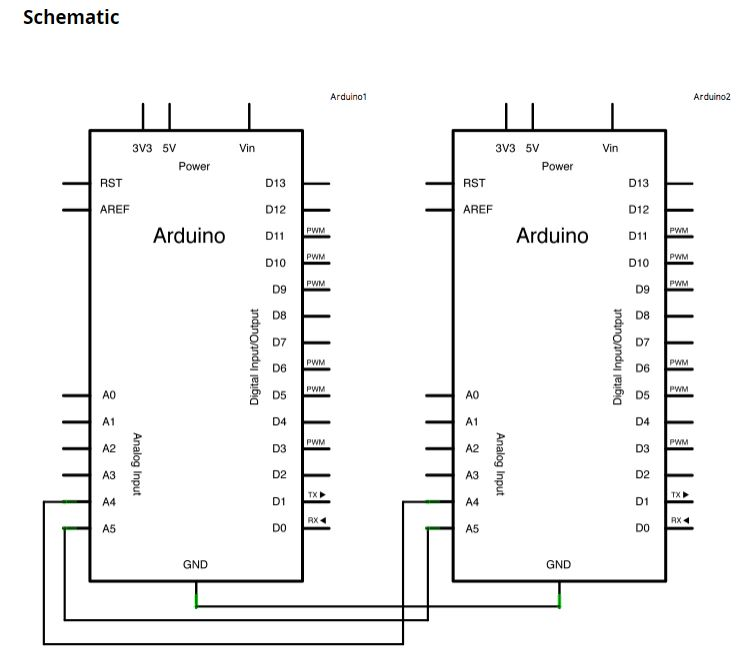
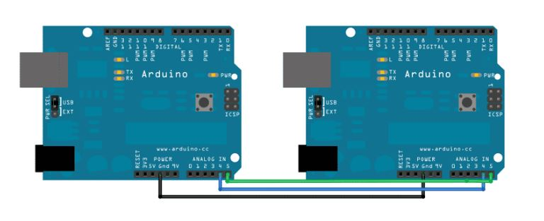

This sketch will turn any Arduino into an I2C Slave whose pins can be manipulated by a master.  Your wiring will look something like this (depending on your Arduinos):

  

  

To use this, set the I2C Address in the sketch appropriately and then refer to it in your Master code.  
To write digital values to the pins on the slave from the master, do something like this:

<code>

//set your I2CAddress in you master code to whatever it is in your sketch
int arduinoSlaveAddress = 20;

//simple example:
Wire.beginTransmission(arduinoSlaveAddress);
Wire.write(2); //will write a digital value to D2 on an Arduino Mini
Wire.write(1); //anything between 1 and 255 counts as HIGH
Wire.endTransmission(); 
delay(800); 
Wire.beginTransmission(arduinoSlaveAddress); 
Wire.write(2); 
Wire.write(0);  //counts as LOW
Wire.endTransmission();
delay(800); 

//using the Analog pins as digital outs:
Wire.beginTransmission(arduinoSlaveAddress);
Wire.write(14); //will write a digital value to A0 on an Arduino Mini
Wire.write(11); //anything between 1 and 255 counts as HIGH
Wire.endTransmission(); 
delay(800); 
Wire.beginTransmission(arduinoSlaveAddress); 
Wire.write(14); 
Wire.write(0);  //counts as LOW
Wire.endTransmission();
delay(800); 

 //sending an analog value to a pin that can do PWM:
 Wire.beginTransmission(arduinoSlaveAddress);
 Wire.write(3); //will write a value to D3 on an Arduino Mini
 Wire.write(257); //anything above 255 does an AnalogWrite(value-256) to the pin
 Wire.endTransmission(); 
 delay(800); 
 Wire.beginTransmission(arduinoSlaveAddress); 
 Wire.write(3); 
 Wire.write(511);  //counts as AnalogWrite(255);
 Wire.endTransmission();
 delay(800); 

//reading an analog or digital value from the slave:
Wire.beginTransmission(arduinoSlaveAddress); 
Wire.write(78); //addresses greater than 64 are the same as AX (AnalogX) where X is 64-value
Wire.endTransmission(); 
delay(100); Wire.requestFrom(arduinoSlaveAddress, 4); 
long totalValue = 0; 
int byteCursor = 1; 
while (Wire.available()) { 
  byte receivedValue = Wire.read(); // Read the received value from slave 
  totalValue = totalValue + receivedValue * pow(256, 4-byteCursor); 
  Serial.println(receivedValue); // Print the received value 
  byteCursor++; 
} 
Serial.print(millis()); 
Serial.print(" "); 
Serial.println((int)totalValue); 
delay(600);
</code>
